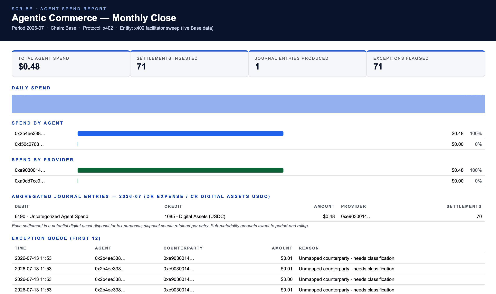

# Counterra

**The open accounting & audit layer for agentic commerce.**

AI agents now pay for data, tools, and compute over machine payment
rails like [x402](https://x402.org) — millions of micropayments with
**no invoices, no receipts, no books**. Counterra reads those payments
straight off the chain and produces what a finance team actually
needs: per-agent spend attribution, aggregated journal entries,
tax-relevant disposal counts, and an exception queue.

*Agents move the money. Counterra makes it count.*

## 🔴 Try it live — no install

**[counterra.xyz](https://counterra.xyz)** — paste any Base
wallet (or hit "Random live agent") and watch Counterra close its books on
real x402 traffic, in your browser. Non-custodial: nothing leaves your tab.



*Above: a real monthly close generated from live Base mainnet data —
71 x402 settlements made by an autonomous agent on the morning of
13 July 2026, decoded, attributed, and rolled into books.*

## What it does

- **Ingest** — sweeps settlements submitted by x402 facilitator
  wallets on Base (Coinbase runs ~40 and rotates them; Counterra
  auto-refreshes the list from the community registry), decodes the
  USDC transfers inside: payer (agent) → payee (seller) → amount.
- **Ledger** — attributes spend per agent, aggregates thousands of
  sub-cent events into ERP-ready journal entries
  (Dr expense / Cr Digital Assets), flags unmapped counterparties
  and anomalies into an exception queue.
- **Comply** — retains per-entry settlement counts (each is a
  potential digital-asset disposal for tax purposes). VAT/GST module
  and confidential-rail audit ingestion are on the roadmap.

Counterra is **non-custodial by design**: it reads public ledgers,
never holds or moves funds, and has no token.

## Quick start

```bash
pip install pyyaml requests

python3 counterra.py demo                    # simulated x402 traffic
python3 counterra.py refresh                 # pull newest facilitator wallets
python3 counterra.py live --limit 80         # real Base data (no API key needed)
python3 counterra.py live --chain solana --limit 40   # real Solana data (public RPC, no key)
python3 counterra.py classify --write        # auto-identify unmapped sellers into the registry
python3 counterra.py live --wallet 0xABC...  # track one payer wallet
```

Outputs land in `out/`: `spend_report.html` (monthly close) and
`journal_entries.csv` (ERP-import ready). Unknown sellers appear in
the exception queue; map them under `providers:` in `config.yaml`
and re-run to see them classified into proper expense accounts.

Live data uses Blockscout's free public API for Base and Solana's
public mainnet RPC — no keys required. For faster Solana sweeps, put
a free Helius endpoint in `.env` as `SOLANA_RPC_URL=...`. An Etherscan key in `.env` enables Etherscan mode for
other chains/paid tiers.

## Tests (offline, no key)

```bash
python3 tests/test_live.py
```

Canned API-shaped fixtures verify the full decode path, wallet
filtering, and the facilitator-refresh rewrite.

## Why this exists

The x402 protocol deliberately removed accounts, invoices, and
billing relationships from payments — that is its genius for
machines, and its unsolved liability for the businesses deploying
them. Industry reviewers note that tax and invoicing remain
unaddressed at the protocol level, and enterprises name the
audit/accountability gap as the blocker for autonomous transactions.
Every rail is bundling reporting for its own rail; nobody owns the
neutral layer across rails. Counterra is that layer, built in the open.

## Roadmap

- [x] Base collector (facilitator sweep + wallet tracking), live-verified
- [x] Agentic subledger: attribution, aggregation, exceptions
- [x] Facilitator auto-refresh from the x402scan community registry
- [x] Auto-classification — `counterra.py classify [--write]`: batch-identifies every unmapped seller from the last run and appends evidenced entries to the registry
- [x] Open seller-mapping registry — `docs/providers.json`, served live at counterra.xyz/providers.json; evidence-required community contributions (see CONTRIBUTING.md)
- [ ] Receipt/evidence alignment (TrustBench-compatible) via x402 Foundation process
- [x] Solana collector — facilitator sweep + wallet tracking (Coinbase + PayAI facilitators), live-ready
- [ ] QuickBooks/Xero journal sync
- [ ] Public "agent spend explorer" (paste a wallet, get books)
- [ ] VAT/GST & disposal tax module
- [ ] Confidential-rail audit ingestion (viewing keys)

## Repo map

```
counterra.py             CLI (demo / live / refresh)
counterralib/ingest.py   canonical PaymentEvent + sample generator
counterralib/live.py     Base adapter (Blockscout/Etherscan) + registry refresh
counterralib/ledger.py   attribution, aggregation, journal entries, exceptions
report.py             HTML monthly-close report
config.yaml           chain, facilitators, agent/provider maps, chart of accounts
tests/                offline test suite
```

## License

Apache-2.0. Open core; use it, fork it, build on it.
